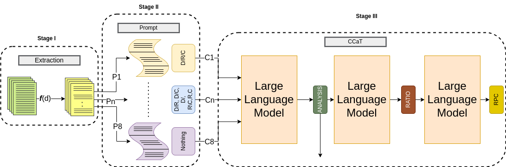
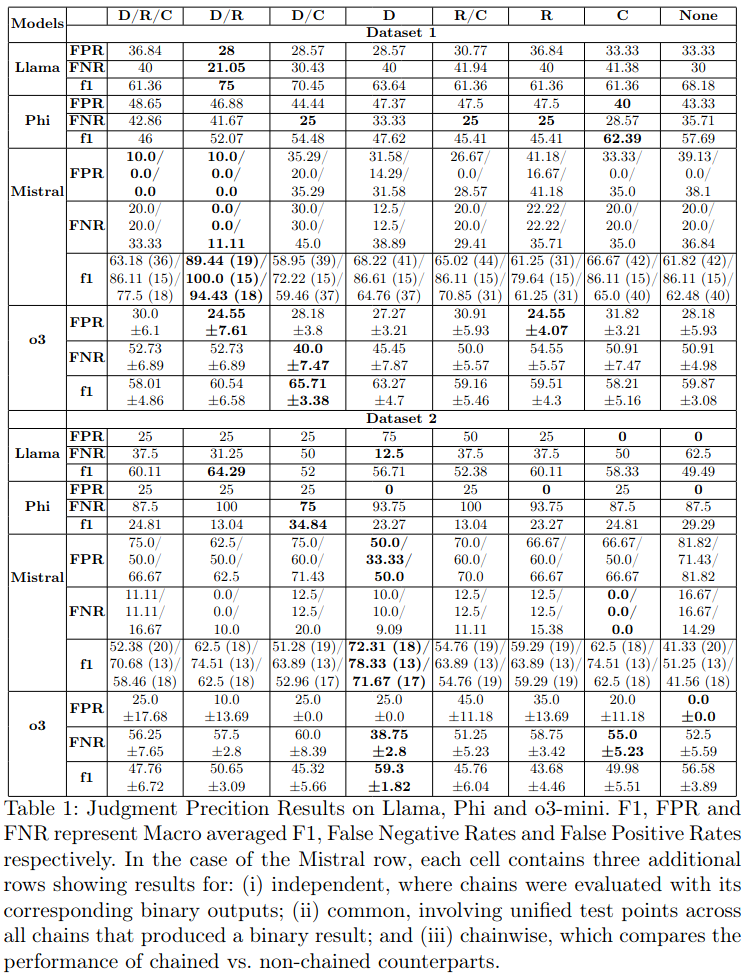
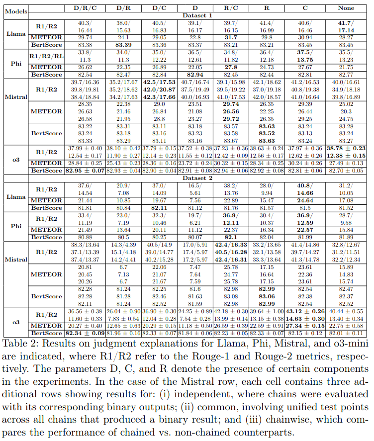
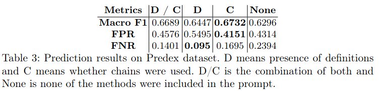

# Structured Definitions and Segmentations for Legal Reasoning in LLMs: A Study on Indian Legal Data

📄 **[Read the Full Paper](#)**  
<!-- Replace # with the actual paper link -->

---

## 📑 Abstract

Large Language Models (LLMs), though highly capable in general tasks, underperform in specialized domains such as legal reasoning due to lack of domain-specific pretraining. This paper explores how structured inputs—using rhetorical roles, definitions, and chained reasoning—can improve legal judgment prediction in Indian court cases.

We propose three enhancements:
- 🧱 **Rhetorical Role Segmentation**: Structuring inputs based on roles like Facts, Arguments, etc.
- 📘 **Role Definitions**: Including definitions to help LLMs interpret legal jargon
- 🔁 **Chained Reasoning**: Emulating court-like step-by-step decisions

Our zero-shot experiments across three datasets show performance improvements up to **4.36% in F1-score** with minimal intervention.

---

## 🧠 Methodology

We evaluate the impact of structured prompting using:
- **D**: Definitions
- **R**: Rhetorical segmentation
- **C**: Chaining (recursive reasoning)

### Prompt Structure Workflow


*Figure 1: Prompt restructuring and chaining architecture.*

---

## 📊 Results

### ⚖️ Judgment Prediction (Macro F1, FPR, FNR)


*Table 1: Prediction results across LLaMA, Mistral, Phi, and o3-mini.*

### 🧾 Explanation Quality (ROUGE, METEOR, BERTScore)


*Table 2: Explanation generation metrics comparing models and ablations.*

### 🧮 Metrics on PredEx Dataset


*Table 3: Macro-F1, FPR, and FNR with and without structured prompting.*

---

## 🧪 Key Findings

- 🏛️ **Best performance** is not achieved by combining all components—selective structuring yields better results.
- 🧩 **Definitions (D)** help LLMs learn legal jargon.
- 🧱 **Segmentation (R)** helps organize information effectively.
- 🔁 **Chaining (C)** improves consistency and logical depth.

---

## 📚 BibTeX Citation

```bibtex
@inproceedings{khatri2025legal,
  title={Structured Definitions and Segmentations for Legal Reasoning in LLMs: A Study on Indian Legal Data},
  author={Khatri, Mann and Yusuf, Mirza and Shah, Rajiv Ratn and Kumaraguru, Ponnurangam},
  booktitle={Proceedings of the Big Data Analytics (BDA)},
  year={2025},
  organization={Springer}
}
